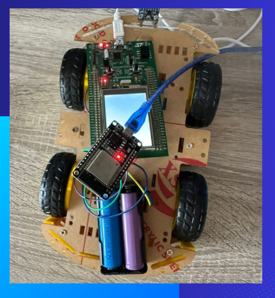
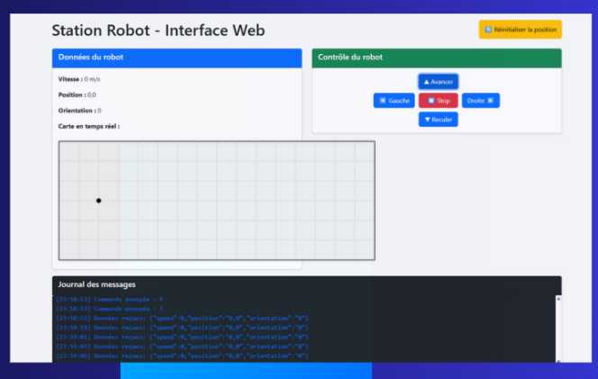

# 🤖 Robot-Station Communication Using FreeRTOS

A distributed embedded system for real-time control of a mobile robot using ESP32 (Wi-Fi communication) and STM32 (FreeRTOS) microcontrollers. The system features remote control capabilities, real-time position tracking, and a web-based interface for monitoring and control.

## 🎯 Project Overview

This project demonstrates a complete cyber-physical system that combines embedded processing with wireless network communication for remote robot control. The system integrates two microcontrollers with distinct roles: ESP32 handles Wi-Fi communication and sensor data processing, while STM32 manages real-time motor control using FreeRTOS.

### Key Features

- **Distributed Architecture**: ESP32 + STM32 dual-microcontroller system
- **Real-Time Control**: FreeRTOS-based multitasking on STM32
- **Wireless Communication**: Wi-Fi connectivity with HTTP server
- **Web Interface**: Real-time robot control and monitoring
- **Position Tracking**: Speed sensor integration with position calculation
- **Bidirectional Communication**: UART, HTTP, and WebSocket protocols

## 🤖 Robot Used in the Project

This is the robot used in this project:




## 🏗️ System Architecture

### Component Overview

| Component | Role | Technology |
|-----------|------|------------|
| **ESP32** | Wi-Fi Gateway & Sensor Processing | Arduino IDE, Wi-Fi, HTTP Server |
| **STM32F429I** | Real-Time Motor Control | STM32CubeIDE, FreeRTOS |
| **L298N** | Motor Driver | H-Bridge Motor Controller |
| **FC-03** | Speed Sensor | Optical Speed Detection |
| **Flask Server** | Web Backend | Python, Flask, WebSocket |
| **Web Interface** | User Control Panel | HTML/CSS/JavaScript |

### Architecture Diagram

```
┌─────────────────┐    WebSocket    ┌─────────────────┐
│   Web Interface │◄────────────────┤  Flask Server   │
│   (HTML/JS/CSS) │                 │    (Python)     │
└─────────────────┘                 └─────────────────┘
                                            │ HTTP
                                            ▼
┌─────────────────┐      UART       ┌─────────────────┐
│      ESP32      │◄────────────────┤     STM32       │
│   (Wi-Fi/HTTP)  │                 │   (FreeRTOS)    │
└─────────────────┘                 └─────────────────┘
         │                                   │
         │ GPIO                              │ GPIO
         ▼                                   ▼
┌─────────────────┐                 ┌─────────────────┐
│   FC-03 Sensor  │                 │  L298N + Motors │
│ (Speed/Position)│                 │   (Movement)    │
└─────────────────┘                 └─────────────────┘
```

## 🖥️ Control Station Interface

This is the control station interface used to monitor and control the robot:




## 🛠️ Technologies Used

### Hardware Components
- **ESP32 DevKit** - Wi-Fi communication and sensor processing
- **STM32F429I** - Real-time motor control
- **L298N Motor Driver** - Dual H-bridge motor controller
- **FC-03 Speed Sensor** - Optical speed detection
- **DC Motors** - Robot locomotion

### Software Stack
- **STM32CubeIDE** - STM32 development environment
- **Arduino IDE** - ESP32 programming
- **FreeRTOS** - Real-time operating system
- **Flask** - Python web framework
- **WebSocket** - Real-time web communication
- **UART/HTTP** - Inter-device communication protocols

## 🚀 Installation & Setup

### Prerequisites
```bash
# Required software
- STM32CubeIDE
- Arduino IDE with ESP32 board support
- Python 3.8+
- Git
```
